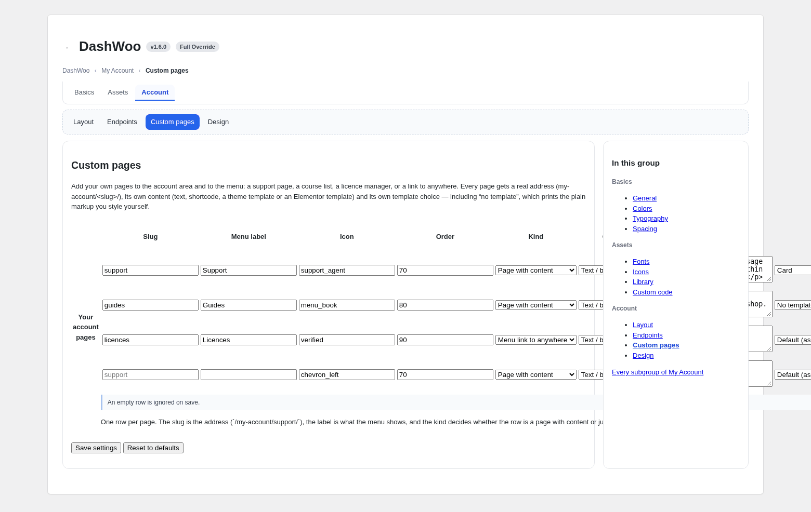
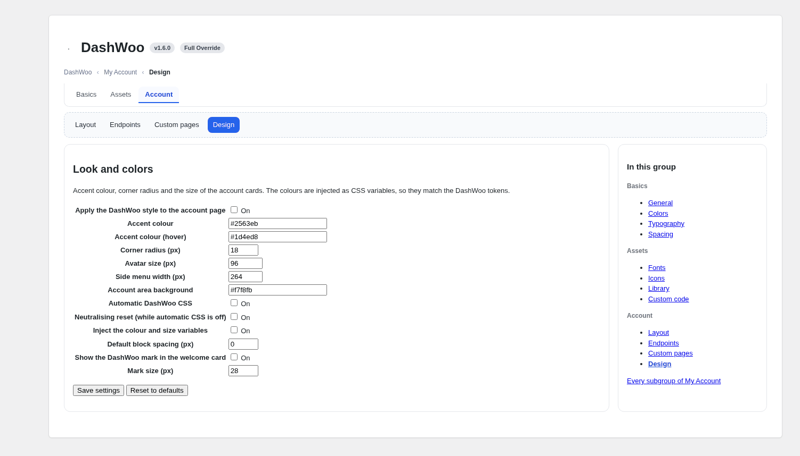
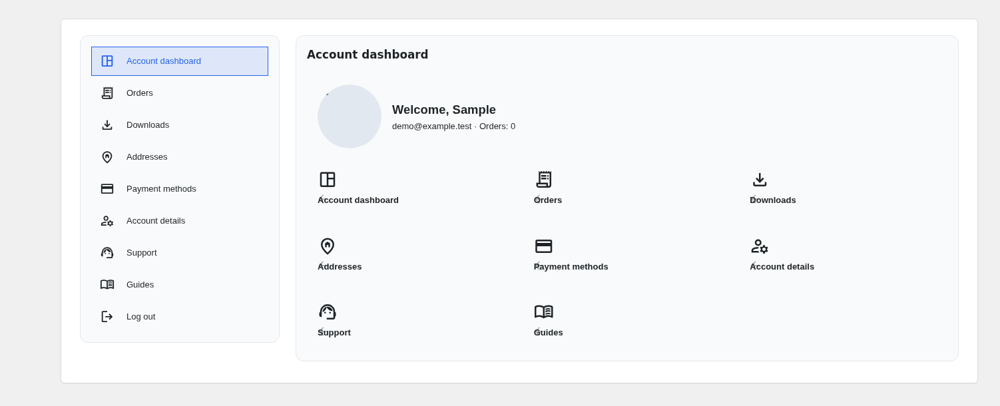
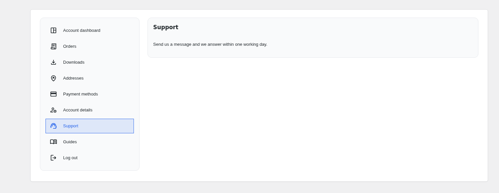
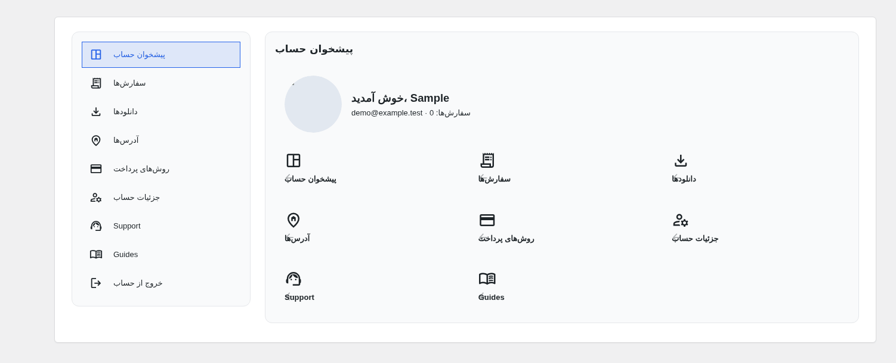
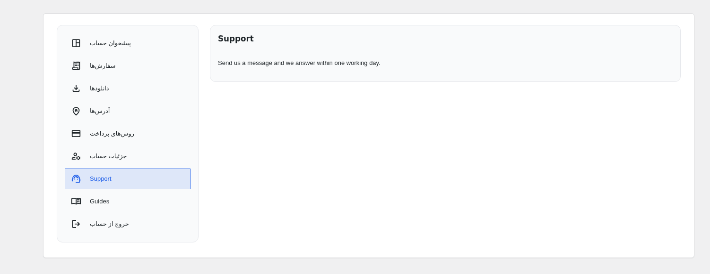

# Dwoo — DashWoo

**A UI platform for WooCommerce × Elementor.** DashWoo gives a shop one place for the
whole storefront interface: fonts, icons, images, custom code, design tokens, the My
Account area and the Elementor widgets that draw them — served from your own server,
with **no dependency on any external CDN**.

*Product name: DashWoo. Visual identity: Dwoo.*

**Language:** English · [فارسی](#فارسی)

---

## Preview

Real screenshots of the plugin — nothing here is a drawing.

| Settings | My Account → Design |
| --- | --- |
|  |  |

| Account panel (menu card + content card) | A custom page with its own content box |
| --- | --- |
|  |  |

The same two screens with the shipped Persian catalogue and right-to-left layout:

| پنل حساب کاربری | صفحهٔ سفارشی‌سازی‌شده |
| --- | --- |
|  |  |

---

## What it does

- **Local fonts and icons** — Google Fonts and Material Symbols are downloaded into
  `wp-content/uploads/dashwoo/`, with the upstream metadata kept so an update only touches
  the files that changed. Nothing is ever requested from Google's servers on a page view.
- **Asset library** — images, sanitized SVG, uploaded fonts and custom CSS/JS, managed from
  the WordPress dashboard and stored outside the plugin folder, so updates never delete
  your files.
- **Design tokens → CSS variables** — colours, typography, spacing, radius and shadows
  compile to a local stylesheet, reach Elementor's global tokens, and can be read by any
  theme or widget as `var(--dw-*)`.
- **Elementor integration** — a token picker, a token-driven widget, kit sync with backup
  and revert, and twelve My Account widgets, all in **one** DashWoo category.
- **My Account kit** — the account area is DashWoo's own: a menu card next to a content
  card, orders, downloads, addresses, payment methods, account details, forms and logout,
  each with its own template and its own theme override.
- **Custom endpoints and pages** — add your own account pages (slug, label, icon, order,
  capability, visibility) and they become real endpoints in the account menu. Every page
  renders a content box whose source is HTML, a shortcode, an Elementor template or a
  theme file — or no template at all.
- **Zero design by default** — DashWoo loads no stylesheet of its own on the front end
  unless you switch it on. The widgets come out as plain markup with class hooks, ready
  for your theme, your CSS or Elementor.
- **Nothing is a hard dependency** — WooCommerce, Elementor and WordPress internals all go
  through a version compatibility layer with floors, an activation check and an automatic
  Compatibility Mode. WooCommerce is never told DashWoo is incompatible, and host features
  that are missing (GD, Imagick, zip) turn their own feature off and report it as
  information, never as a warning.
- **English source, Persian ready** — every string is English in the code and goes through
  the WordPress gettext layer. A complete Persian (`fa_IR`) catalogue ships with the
  plugin, the JavaScript catalogue included, and the platform is right-to-left aware.
- **Protected build** — the released plugin is not readable source. Every logic file ships
  as a stub that asks the module kernel for its own body at runtime; a file that is edited
  by hand stops working in that module only, tells the administrator which file was
  touched, and leaves the site and the data untouched.

## System requirements

| | |
| --- | --- |
| WordPress | 6.4 or newer (tested up to 6.8) |
| PHP | 8.0 or newer |
| WooCommerce | 8.5 or newer |
| Elementor | 3.24 or newer (Elementor Pro 3.19 or newer) |
| Database | MySQL 5.7 / MariaDB 10.3 or newer |
| Optional | GD or Imagick (image resizing), ZipArchive (font/icon packages) — both stay off and are reported as information when missing |

Nothing else is required: no composer, no build step on the server, no external service.

## Install

1. Download `dashwoo-1.6.0.zip` from the [releases](../../releases) page.
2. WordPress → Plugins → Add New → Upload Plugin → choose the zip → Install → Activate.
3. Open **DashWoo** in the admin menu.

Keep the zip you installed: the released build is protected, so a later build carries a
different key and an earlier install can only be repaired with the same file again.

## Repository

`DashWoo` is the **built plugin** — this repository is its root. The source tree (tests,
build scripts, docs) lives in a separate private repository.

---

<h2 id="فارسی">فارسی</h2>

**Dwoo یک پلتفرم رابط کاربری برای ووکامرس و المنتور است.** DashWoo همهٔ ظاهر فروشگاه را در
یک جا در اختیار شما می‌گذارد: قلم‌ها، آیکون‌ها، تصاویر، کد سفارشی، توکن‌های طراحی، بخش «حساب
کاربری من» و ویجت‌های المنتور — همه از روی سرور خودتان، **بدون هیچ وابستگی به CDN بیرونی**.

*نام محصول همان DashWoo است و هویت بصری آن Dwoo.*

- **صفحهٔ پیش‌نمایش:** تصاویر واقعی افزونه (نه طرح دستی) در همین صفحه، هم انگلیسی و هم فارسی.
- **صفر طراحی به‌صورت پیش‌فرض:** DashWoo در بخش کاربری هیچ شیوه‌نامه‌ای از خودش بارگذاری
  نمی‌کند؛ نشانه‌گذاری ساده با کلاس‌های آماده در اختیار شماست تا با پوسته، CSS خودتان یا
  المنتور همه‌چیز را قالب‌بندی کنید.
- **منو و پیشخوان جدا از هم:** برای بخش حساب می‌توانید صفحه‌های دلخواه (نشانی، برچسب، آیکون،
  ترتیب، دسترسی و نمایش) بسازید و منو را کامل مدیریت کنید؛ هر صفحه یک جعبهٔ محتوا دارد که
  می‌تواند HTML، شورت‌کد، قالب المنتور یا فایل پوسته باشد — یا هیچ قالبی نداشته باشد.
- **انگلیسی با پشتیبانی کامل فارسی:** همهٔ رشته‌ها در کد انگلیسی هستند و از لایهٔ ترجمهٔ
  وردپرس می‌گذرند؛ بستهٔ فارسی (`fa_IR`) کامل همراه افزونه منتشر می‌شود و چیدمان راست‌به‌چپ
  است. زبان پلتفرم را می‌توانید از تنظیمات روی فارسی بگذارید.
- **نصب محافظت‌شده:** نسخهٔ منتشرشده کد خوانا نیست؛ فایل‌ها در زمان اجرا بدنهٔ خود را از هستهٔ
  ماژول می‌گیرند. اگر فایلی دستکاری شود، فقط همان بخش از کار می‌افتد، نام فایل به مدیر
  گزارش می‌شود و سایت و داده‌ها دست‌نخورده می‌مانند.

**پیش‌نیازها:** وردپرس ۶.۴ یا بالاتر، PHP 8.0 یا بالاتر، ووکامرس ۸.۵ یا بالاتر، المنتور
۳.۲۴ یا بالاتر (المنتور پرو ۳.۱۹ یا بالاتر). قابلیت‌های اختیاری میزبان (GD، Imagick، zip)
اگر نبودند، فقط ویژگی وابسته به آن‌ها خاموش می‌شود و به‌صورت اطلاع‌رسانی گزارش می‌شود.
