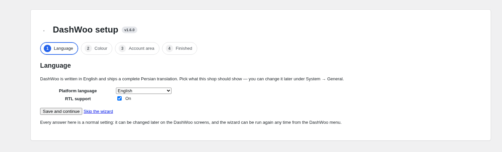
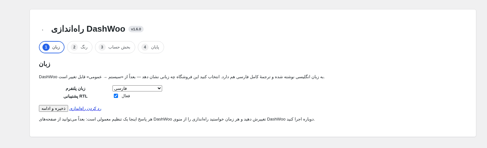

# Dwoo — DashWoo

**A UI platform for WooCommerce × Elementor.** DashWoo gives a shop one place for the
whole storefront interface: fonts, icons, images, custom code, design tokens, the My
Account area and the Elementor widgets that draw them — served from your own server,
with **no dependency on any external CDN**.

*Product name: DashWoo. Visual identity: Dwoo. Persian: [فارسی](#فارسی).*

---

## Preview

Real screenshots of the plugin — nothing here is a drawing.

| Settings | My Account → Design |
| --- | --- |
|  |  |

| Account panel (menu card + content card) | A custom page with its own content box |
| --- | --- |
|  |  |

| Setup wizard | Setup wizard — فارسی |
| --- | --- |
|  |  |

The account panel and a custom page with the shipped Persian catalogue and right-to-left
layout:

| پنل حساب کاربری | صفحهٔ سفارشی |
| --- | --- |
|  |  |

---

## What it does

- **Everything is local.** Google Fonts, Material Symbols, images and SVG are downloaded
  into `wp-content/uploads/dashwoo/` and served from your own server — no CDN, ever.
  Manage, update and delete them from the dashboard.
- **A design system, not a design.** Colours, typography, spacing and radius compile to CSS
  variables and reach Elementor's global tokens as `var(--dw-*)`. The front end loads **no
  DashWoo stylesheet** unless you switch one on: the elements come out as plain markup with
  class hooks for your theme, your CSS or Elementor.
- **The account area, customisable.** A menu card next to a content card, twelve Elementor
  widgets in one DashWoo category, templates with theme overrides, and **custom endpoints**:
  add your own pages (slug, label, icon, order, access) and each one gets a content box that
  renders HTML, a shortcode, an Elementor template or a theme file — or no template at all.
- **English source, Persian ready.** Every string is English in the code and goes through the
  WordPress gettext layer; a complete `fa_IR` catalogue ships with the plugin, the JavaScript
  catalogue included, and the platform is right-to-left aware.
- **Nothing is a hard dependency.** WooCommerce, Elementor and WordPress internals go through
  a version compatibility layer with floors, an activation check and an automatic
  Compatibility Mode; missing host features (GD, Imagick, zip) simply stay off.

## Setup

Activating DashWoo offers a four-step setup wizard — language, colour, account area, done
(see the preview above).
It writes normal settings through the same API as the settings screens, it can be skipped,
and it is reachable from the DashWoo menu whenever you want to run it again. A site that
updates from a version before 1.5 is asked once whether it wants the guided pass; the
wizard arrived with 1.6.

## System requirements

| | |
| --- | --- |
| WordPress | 6.4 or newer (tested up to 6.8) |
| PHP | 8.0 or newer |
| WooCommerce | 8.5 or newer |
| Elementor | 3.24 or newer (Elementor Pro 3.19 or newer) |
| Database | MySQL 5.7 / MariaDB 10.3 or newer |
| Optional | GD or Imagick (image resizing), ZipArchive (font/icon packages) — both stay off and are reported as information when missing |

Nothing else is required: no composer, no build step on the server, no external service.

## Install

1. Download `dashwoo-1.6.0.zip` from the [releases](../../releases) page.
2. WordPress → Plugins → Add New → Upload Plugin → choose the zip → Install → Activate.
3. Open **DashWoo** in the admin menu.

Keep the zip you installed: the released build is protected, so a later build carries a
different key and an earlier install can only be repaired with the same file again.

## Repository

`DashWoo` is the **built plugin** — this repository is its root. The source tree (tests,
build scripts, docs) lives in a separate private repository.

**Contributors:** obsifox.

---

<h2 id="فارسی">فارسی</h2>

**Dwoo یک پلتفرم رابط کاربری برای ووکامرس و المنتور است.** DashWoo همهٔ ظاهر فروشگاه را در
یک جا در اختیار شما می‌گذارد: قلم‌ها، آیکون‌ها، تصاویر، کد سفارشی، توکن‌های طراحی، بخش «حساب
کاربری من» و ویجت‌های المنتور — همه از روی سرور خودتان، **بدون هیچ وابستگی به CDN بیرونی**.

*نام محصول همان DashWoo است و هویت بصری آن Dwoo.*

- **صفحهٔ پیش‌نمایش:** تصاویر واقعی افزونه (نه طرح دستی) در همین صفحه، هم انگلیسی و هم فارسی.
- **صفر طراحی به‌صورت پیش‌فرض:** DashWoo در بخش کاربری هیچ شیوه‌نامه‌ای از خودش بارگذاری
  نمی‌کند؛ نشانه‌گذاری ساده با کلاس‌های آماده در اختیار شماست تا با پوسته، CSS خودتان یا
  المنتور همه‌چیز را قالب‌بندی کنید.
- **منو و پیشخوان جدا از هم:** برای بخش حساب می‌توانید صفحه‌های دلخواه (نشانی، برچسب، آیکون،
  ترتیب، دسترسی و نمایش) بسازید و منو را کامل مدیریت کنید؛ هر صفحه یک جعبهٔ محتوا دارد که
  می‌تواند HTML، شورت‌کد، قالب المنتور یا فایل پوسته باشد — یا هیچ قالبی نداشته باشد.
- **انگلیسی با پشتیبانی کامل فارسی:** همهٔ رشته‌ها در کد انگلیسی هستند و از لایهٔ ترجمهٔ
  وردپرس می‌گذرند؛ بستهٔ فارسی (`fa_IR`) کامل همراه افزونه منتشر می‌شود و چیدمان راست‌به‌چپ
  است. زبان پلتفرم را می‌توانید از تنظیمات روی فارسی بگذارید.
- **راه‌اندازی گام‌به‌گام:** هنگام فعال‌سازی، یک راه‌انداز چهار‌گامی (زبان، رنگ، بخش حساب و
  پایان) پیشنهاد می‌شود؛ می‌توانید ردش کنید و هر وقت خواستید از منوی DashWoo دوباره اجرایش
  کنید. اگر نسخهٔ فعلی سایت‌تان پیش از ۱.۵ بوده، یک بار از شما پرسیده می‌شود.

**پیش‌نیازها:** وردپرس ۶.۴ یا بالاتر، PHP 8.0 یا بالاتر، ووکامرس ۸.۵ یا بالاتر، المنتور
۳.۲۴ یا بالاتر (المنتور پرو ۳.۱۹ یا بالاتر). قابلیت‌های اختیاری میزبان (GD، Imagick، zip)
اگر نبودند، فقط ویژگی وابسته به آن‌ها خاموش می‌شود و به‌صورت اطلاع‌رسانی گزارش می‌شود.
